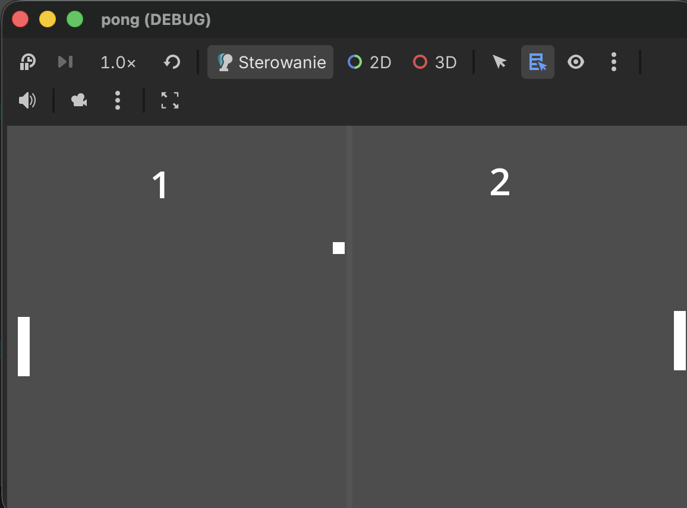

# Klasyczny Pong w Godot 4 🏓

Mój pierwszy projekt stworzony w silniku **Godot 4**. To klasyczna, dwuosobowa wersja kultowej gry Pong z kilkoma usprawnieniami mechaniki.

## ✨ Funkcje gry
* **Lokalny Multiplayer:** Gra dla dwóch graczy na jednej klawiaturze.
* **System Punktacji:** Automatyczne zliczanie goli, wyświetlanie wyniku na ekranie i resetowanie pozycji piłki.
* **Rosnący Poziom Trudności:** Piłka przyspiesza po każdym odbiciu od paletki lub ściany, co sprawia, że wymiany są coraz bardziej intensywne!
* **Efekty Dźwiękowe:** Klasyczne dźwięki przy odbiciach nadające grze charakteru retro.
* **Dopracowana Fizyka:** Specjalny kod zapobiegający błędowi "przyklejania się" piłki do krawędzi paletek.

## 🎮 Sterowanie

| Gracz | Ruch w górę | Ruch w dół |
| :--- | :--- | :--- |
| **Gracz 1 (Lewy)** | `W` | `S` |
| **Gracz 2 (Prawy)** | `Strzałka w górę` | `Strzałka w dół` |

## 🛠️ Technologie
* **Silnik:** Godot Engine 4 (macOS)
* **Język:** GDScript

## 🚀 Jak uruchomić projekt?
1. Pobierz lub sklonuj to repozytorium na swój komputer.
2. Pobierz i otwórz silnik **Godot 4**.
3. W menedżerze projektów kliknij **Import** i wskaż plik `project.godot` z pobranego folderu.
4. Uruchom grę klikając ikonę **Play** (lub naciskając `Cmd + B` / `F5`).